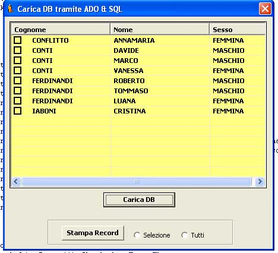



## Load and Print records presents in the ListView with connection ADO

### Description

It loads the present records to the inside with a Database in a ListView with ADO and through SQL it is possible to load the records, it includes also the ordering of the columns in ascending way or descending with the icon that it indicates the type of ordering. Finally the present records in the ListVIew are possible to print through 2 selections all or the records select to you through checkbox. Code is full commented! PLeaSe VoTe FoR Me!!!
 
### More Info
 

             |
---                |---
**Submitted On**   |2002-09-25 16:54:16
**By**             |[d@w conti](https://github.com/Planet-Source-Code/PSCIndex/blob/master/ByAuthor/d-w-conti.md)
**Level**          |Intermediate
**User Rating**    |4.8 (19 globes from 4 users)
**Compatibility**  |VB 6\.0
**Category**       |[Databases/ Data Access/ DAO/ ADO](https://github.com/Planet-Source-Code/PSCIndex/blob/master/ByCategory/databases-data-access-dao-ado__1-6.md)
**World**          |[Visual Basic](https://github.com/Planet-Source-Code/PSCIndex/blob/master/ByWorld/visual-basic.md)
**Archive File**   |[Load\_and\_P14971911142002\.zip](https://github.com/Planet-Source-Code/d-w-conti-load-and-print-records-presents-in-the-listview-with-connection-ado__1-40715/archive/master.zip)

